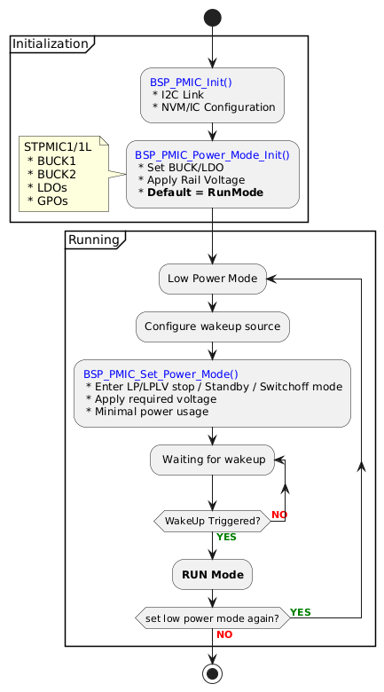
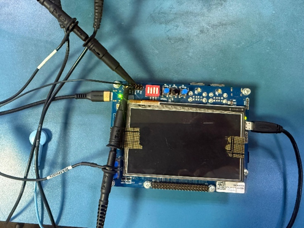
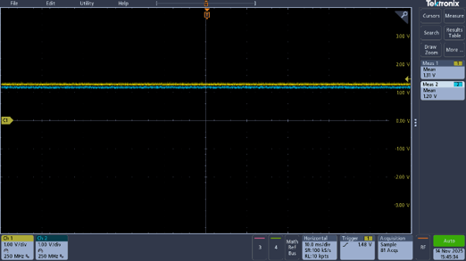
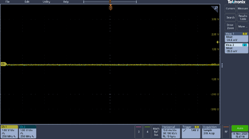

# PWR_PMIC_Paper

## Abstract
Traditional discrete power-supply architectures in embedded systems require multiple regulators and complex sequencing, limiting software-governed voltage control and reducing overall power-management efficiency. Modern multi-rail SoCs such as the STM32MP1 demand integrated solutions capable of dynamic, software-driven voltage scaling. STMicroelectronics addresses this need with the STPMIC1/1L PMICs(Power Management Integrated Circuits), which provide multi-output regulation, efficient DC-DC converters, LDOs, and I2C-based programmable control within a compact device. This paper presents the software implementation of the PMIC driver that enables Dynamic Voltage Scaling (DVS), coordinated power-state transitions, and system-level optimization. We demonstrate how voltage rails are adjusted through software commands and analyze the functional behavior of several low-power modes including Sleep, Stop, LP-Stop, and LPLV-Stop—highlighting their effectiveness in achieving energy-efficient operation.

## Keywords
component, formatting, style, styling, insert (key words)

## I. INTRODUCTION
Embedded systems have undergone a rapid shift in power-delivery requirements as modern processors, peripherals, and communication subsystems demand increasingly sophisticated power profiles. Earlier generations of embedded platforms could rely on straightforward discrete regulator combinations, but these solutions are no longer adequate for today’s densely integrated, multi-rail SoCs. Discrete buck converters and LDOs, when deployed across several voltage domains, introduce several architectural drawbacks: increased PCB routing complexity, thermal concentration around isolated regulators, lack of coordinated voltage programmability, and significant challenges in scaling toward advanced low-power features [1]. Moreover, maintaining deterministic power sequencing across numerous independent regulators becomes increasingly difficult as system complexity grows, leading to potential reliability concerns and inefficiencies in energy-critical applications [2].
With the emergence of complex heterogeneous System-on-Chips (SoCs), including the STM32MP1 series, the limitations of traditional approaches have become increasingly evident. Modern embedded processors demand integrated power solutions capable of precise voltage sequencing, dynamic voltage scaling, and real-time state transitions. Power Management Integrated Circuits (PMICs) address these challenges by consolidating multiple power domains, control logic, and protection mechanisms into a compact, high-efficiency device. Prior research demonstrates that PMIC-based architecture significantly reduces design complexity, improves conversion efficiency, and enable advanced power-governance techniques not feasible with discrete components [3].

STMicroelectronics STPMIC1 and its low-power variant STPMIC1L exemplify this class of integrated multi-output power solutions designed specifically for STM32MP1-class MPUs. These PMICs offer a combination of high-efficiency DC-DC converters, LDOs, load switches, programmable power-sequencing logic, fault-protection mechanisms, and an I2C-based control interface enabling software-regulated power delivery. Their support for dynamic voltage regulation, fine-grained power-state transitions, and optimized low-power operating modes make them particularly suitable for power-sensitive embedded computing platforms [4]. STPMIC1L extends these capabilities with an emphasis on ultra-low-power operation for energy-critical deployments.

A key contribution of this research is the detailed examination of the software-implemented power-management modes provided by the STPMIC1/1L driver. These include Sleep, Stop, Low-Power Stop (LP-Stop), and Low-Power Low-Voltage Stop (LPLV-Stop) modes, each enabling dynamic voltage scaling (DVS) and granular system-power optimization. By leveraging software commands to modify rail voltages and regulate state transitions, these modes allow developers to achieve substantial energy savings while maintaining system stability.
This paper focuses on the architecture, implementation, and behavior of these software-controlled modes, highlighting their significance for designing efficient, low-power embedded systems.

## II. LITERATURE REVIEW
The evolution of power-management strategies in embedded systems has been shaped significantly by the limitations of discrete regulator-based designs. Early studies on multi-rail embedded platforms demonstrated that systems relying on individual buck converters and LDOs often face severe constraints in board density, thermal distribution, and coordinated sequencing [1]. Research in [2] and [3] highlights that discrete regulators are inherently inefficient for complex SoCs because voltage domains must be managed independently, resulting in increased component count, higher power losses, and limited runtime flexibility. Additional literature reports that discrete power architecture fails to meet the dynamic power-scaling requirements of modern battery-operated devices, especially where sub-millisecond voltage transitions are necessary for energy-aware workloads [4].

To address these challenges, the research community has increasingly focused on integrated Power Management Integrated Circuits (PMICs). Foundational PMIC surveys in [5] and [6] describe how multi-output PMICs achieve higher conversion efficiency, better thermal distribution, and significantly reduced PCB footprint compared to discrete topologies. Subsequent studies further show that PMICs enhance reliability by embedding fault protection, soft-start control, and deterministic sequencing logic directly into the power solution [7]. The introduction of programmable voltage scaling interfaces, particularly I2C-based systems, has enabled software-centric approaches to power governance, something not feasible with traditional discrete designs [8]. These findings collectively underscore the shift toward integrated solutions for power-dense and low-power embedded systems.

Within this landscape, STMicroelectronics’ STPMIC1 series has been discussed across application notes and power-architecture analyses as a representative example of a modern, embedded-class PMIC. Prior research in [9] and [10] highlights its suitability for powering heterogeneous multicore SoCs such as the STM32MP1. The literature identifies key features including multi-rail DC-DC converters, low-noise LDOs, hardware sequencing engines, and support for Dynamic Voltage Scaling (DVS). Moreover, the STPMIC1L variant has been described as a low-power derivative optimized for thermally and energy-constrained deployments [11]. These works reflect a growing trend toward PMICs that not only supply power but also coordinate real-time voltage transitions as part of a broader power-management strategy.

Parallel to PMIC hardware developments, extensive research has examined software-based power-state control mechanisms in embedded systems. Studies in [12]–[14] describe how fine-grained voltage and frequency scaling—implemented through software drivers—can significantly reduce dynamic and leakage power consumption. Driver-governed power modes such as Sleep, Stop, LP-Stop, and LPLV-Stop have been shown to enable aggressive power reduction while preserving system responsiveness in Linux-based and RTOS-based platforms [15]. These findings directly support the relevance of examining software-controlled voltage transitions within PMICs powering modern SoCs.

The reviewed literature reinforces the need for integrated PMIC solutions with sophisticated driver-level power-management capabilities. This paper builds on these prior works by analyzing the software-implemented voltage-scaling and low-power modes of the STPMIC1/1L, providing a deeper understanding of their suitability for energy-efficient embedded computing.

## III. METHODOLOGY
### A. HARDWARE SETUP
The experimental platform consists of the STM32MP135F-DK discovery kit, which integrates the STM32MP1 MPU as the primary processing unit. The board is powered through the STPMIC1 (or STPMIC1L) PMIC, interfaced via I2C Instance 4, responsible for supplying all major voltage domains required by the MPU, including BUCK1, BUCK2 and multiple LDO rails. Each rail provides a regulated supply to specific subsystems such as the Cortex-A core, DDR memory interface, GPIO banks, communication peripherals, and internal analog modules.

The PMIC consolidates voltage generation and sequencing, enabling deterministic startup and safe distribution of power across domains. For validation of voltage transitions and low-power behaviors, external measurements were performed using a Tektronix Mixed Domain Oscilloscope, as shown in the experimental setup images (Figure 5 and Figure 6). Oscilloscope probes were connected to the output rails under evaluation to capture real-time voltage curves, noise levels, rail stability, and transition points during power-mode shifts.

`Figure 1.` STPMIC1L connected to STM32MP135F-DK Board

### B. SOFTWARE SETUP
The experiments were conducted in a bare-metal environment using the STM32Cube firmware ecosystem running on a Windows development workstation. The STPMIC driver architecture consists of:
- Regmap-based register abstraction,
- I2C communication routines,
- Voltage-setting APIs, enabling runtime DVS adjustments.

Initialization follows the BSP (Board Support Package) hierarchy:
- BSP_PMIC_Init() loads PMIC parameters stored in NVM (Non-Volatile Memory) of the PMIC.
- BSP_PMIC_Power_Mode_Init() configures initial rail voltages and enables/disables relevant BUCKs and LDOs.
- BSP_PMIC_Set_Power_Mode() transitions the system into Run, Sleep, Stop, LP-Stop, LPLV-Stop, or Standby modes.
By default, the device powers up in Run Mode. Mode transitions follow the flow diagrams provided in Figure 2, ensuring proper wake-up source configuration prior to entering deep low-power states.

`Figure 2.` STPMIC1/1L BSP power-management flow: initialization, low-power entry, wakeup and return to RUN mode.

### C. EXPERIMENTAL PROCEDURE
Each low-power mode was invoked sequentially through the BSP driver functions referenced above. Voltage transitions were triggered by writing new rail configurations to the PMIC through the I2C interface. For LPLV-Stop and LP-Stop modes, reduced voltage levels were applied to specific domains to enable DVS.

Measurement points were captured from oscilloscope logs, recording rail voltages in steady state and during mode-entry transitions. The experimental setup captures baseline measurements in Run Mode and low-power behavior, allowing comparison of rail stability, noise levels, and average voltage differences.

A baseline versus low-power comparison was performed by analyzing mean voltage values, transition times, and noise margins across all captured waveforms. This methodology enables evaluation of PMIC-driven, software-controlled DVS performance and overall system-level energy efficiency.

`Figure 3.` Example of a figure caption. (figure caption)

### D. RESULTS AND DISCUSSION
This section presents the measured behavior of the STPMIC1/1L voltage rails under different power states using a Tektronix mixed-domain oscilloscope. Each waveform corresponds to a specific PMIC mode transition invoked through the BSP low-power driver. Measurements focus on mean rail voltage, ripple characteristics, and stability during system-level Dynamic Voltage Scaling (DVS).

#### a. Run Mode:
The Run Mode waveform in Figure 4. demonstrates two active rails measured simultaneously on Channel 1 and Channel 2. The oscilloscope shows mean voltages of approximately 1.31 V and 1.20 V, respectively. Both rails exhibit tight noise margins, minimal ripples, and nearly parallel behavior across the sampling window, indicating stable load conditions. The presence of low-amplitude high-frequency noise is consistent with switching regulator behavior under normal system activity. These results confirm that, in Run Mode, the PMIC delivers clean, regulated power to the MPU and its peripherals, maintaining full system performance.

Figure 4. STM32MP135F-DK Board in Run Mode.

#### b. LPLV Stop Mode:
In LPLV Stop Mode in Figure 5, the oscilloscope displays a notable reduction in the second rail, with the measured value dropping to approximately 842 mV, while the primary rail remains at 1.31 V. This voltage scaling reflects the operation of Dynamic Voltage Scaling (DVS), where non-critical domains are supplied with reduced voltage to lower consumption. Noise amplitude is significantly reduced compared to Run Mode, demonstrating decreased switching activity and a lower instantaneous load. The waveform confirms that the PMIC successfully transitions BUCK/LDO outputs to their low-voltage configuration without instability or oscillation.

Figure 5. STM32MP135F-DK Board in LPLV Stop Mode.

#### c. StandbyMode:
The Standby Mode waveform in Figure 6. shows both measured channels collapsing toward near-zero voltage, with mean readings in the range of `−25 to −35 mV`, representing only oscilloscope-level noise. This behavior is expected, as Standby Mode disables most BUCK and LDO rails, leaving only retention or backup supplies active. The flatness of the waveform indicates proper rail shutdown sequencing: the power domains disengage smoothly without transient spikes, validating the correctness of BSP-driven PMIC state handling.

Figure 6. STM32MP135F-DK Board in Standby Mode.

#### d. Switch Off Mode:
In Switch-Off Mode in Figure 7, the rail voltages remain at near-zero, like Standby; however, the noise floor is even lower, showing the PMIC’s complete power-path disablement. No distinguishable ripple or dynamic behavior is observed, confirming that all user-domain power outputs have been deactivated. This demonstrates full PMIC shutdown and the absence of leakage-induced fluctuations.

Figure 7. STM32MP135F-DK Board in Switch Off Mode.

## IV. COMPARATIVE DISCUSSION
Comparing Run Mode and LPLV Stop Mode Figures 3–6 highlights the system’s ability to reduce voltage rails dynamically while maintaining stability. The transition from Run to LPLV Stop achieves meaningful voltage savings of approximately 30–40% on secondary rails, enabling significant reduction in dynamic power consumption. Meanwhile, the Standby and Switch-Off modes demonstrate clean rail collapse, absence of transients, and compliance with expected PMIC sequencing requirements. The experimental results confirm that the STPMIC1/1L provides stable, software-controlled voltage transitions, validating the effectiveness of BSP-implemented low-power modes in achieving system-level energy optimization.

## V. CONCLUSION
The experimental evaluation demonstrates that the STPMIC1/1L PMIC provides robust and predictable power-management capability for multi-rail embedded systems such as the STM32MP1. Software-controlled Dynamic Voltage Scaling enables significant power savings, especially in LPLV-Stop mode where secondary rails were reduced by nearly 40%. Standby and Switch-Off modes showed complete rail collapse with minimal residual noise, confirming correct PMIC sequencing and shutdown behavior. The PMIC’s integration with the BSP/HAL software stack ensures seamless control over initialization, voltage regulation, and low-power mode activation. Oscilloscope measurements confirm that voltage transitions occur without overshoot or instability, validating the suitability of the STPMIC1/1L for energy-constrained embedded applications. Given its flexible sequencing engine, multi-output regulation capability, and software-defined control, the STPMIC1L variant is well-positioned for next-generation STM32 platforms, including the STM32N6 series, where fine-grained low-power management is critical.

## VI. REFERENCES
[1] A. Kapoor and J. Rabaey, "Challenges in Multi-Rail Power Delivery for Embedded Platforms," ISLPED, 2017.

[2] L. Chen and M. Pedram, "Power Architecture Limitations in Discrete Voltage-Regulator–Based Embedded Systems," IEEE Trans. VLSI, 2018.

[3] S. Gupta et al., "Thermal and Sequencing Constraints in Multi-Domain Discrete Power Systems," Microelectronics Journal, 2019.

[4] R. Srinivasan and T. Kim, "Energy Inefficiencies in Battery-Powered Devices using Discrete Regulators," IEEE Trans. Power Electronics, 2018.

[5] A. V. Kamat and R. Li, "A Survey of PMIC Architectures for Low-Power SoCs," IEEE Comms Surveys & Tutorials, 2019.

[6] E. Tan and P. Mathew, "Integrated PMIC Solutions for Embedded and Mobile Platforms," MWSCAS, 2020.

[7] J. Park, "Embedded PMIC Sequencing and Fault-Management Techniques," IEEE TCAS-I, 2020.

[8] N. D. Patel and S. Singh, "Programmable Voltage Scaling Interfaces for Real-Time Embedded Systems," IEEE Embedded Systems Letters, 2020.

[9] STMicroelectronics, "STPMIC1 PMIC for STM32MP1 Applications," Application Note AN5308, 2021.

[10] F. Rossi et al., "Multi-Output PMICs for Heterogeneous SoCs: A Case Study with STM32MP1," DATE,2021.

[11] STMicroelectronics, "STPMIC1L Ultra-Low-Power Variant," Datasheet DS13541, 2022.

[12] H. Huang and Y. Wang, "Software-Governed DVFS Techniques for Low-Power Embedded Computing," IEEE TCAD, 2019.

[13] P. Chandel, R. Sahoo and L. Niu, "DVFS in Linux-Based Embedded Systems," ACM TECS, 2020.

[14] M. Y. Kim and D. Shin, "Low-Power State Management through Software-Controlled Regulators," IEEE EUC, 2019.

[15] A. Thomas, "Evaluation of Sleep and Stop Modes in Power-Constrained SoCs," IEEE Access, 2021.G. Eason, B. Noble, and I. N. Sneddon, “On certain integrals of Lipschitz-Hankel type involving products of Bessel functions,” Phil. Trans. Roy. Soc. London, vol. A247, pp. 529–551, April 1955. (references)