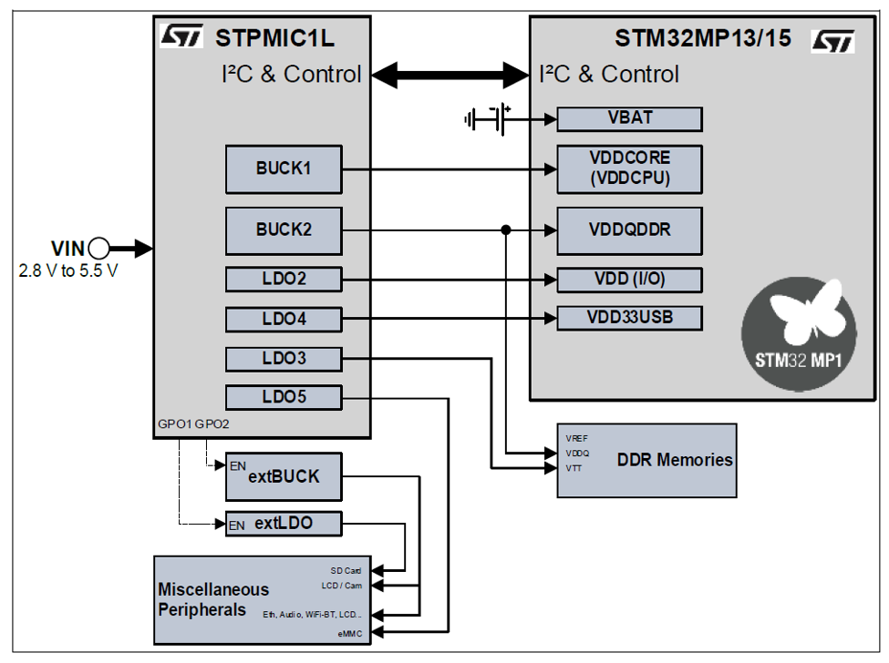
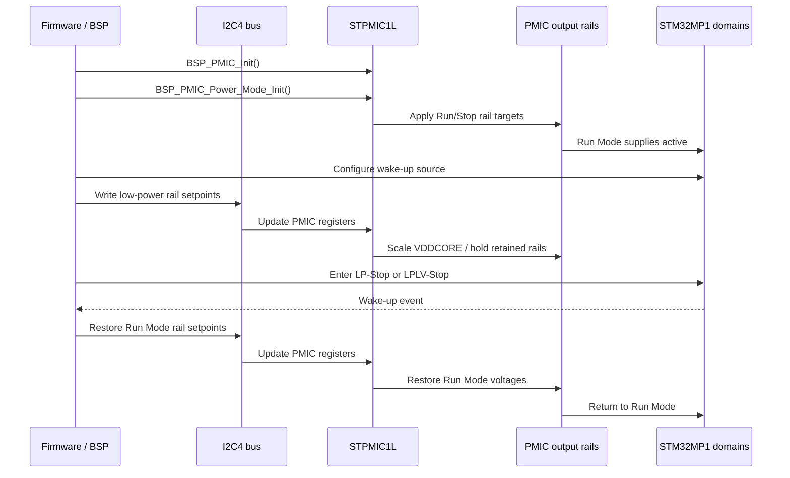
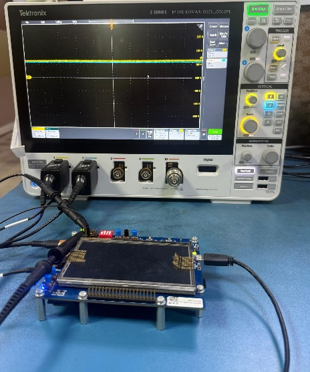
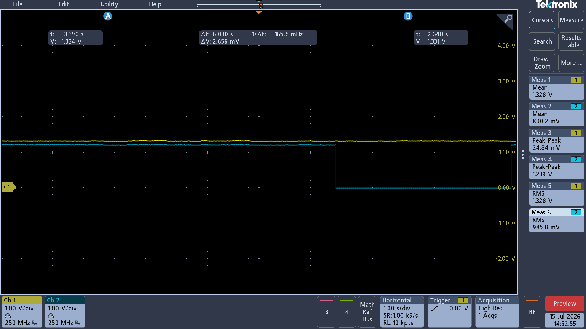
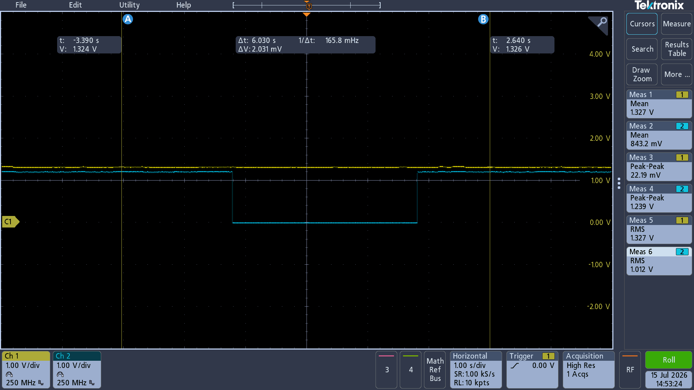
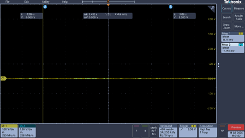

# Software-Controlled Dynamic Voltage Scaling Using the STPMIC1L PMIC for STM32MP1-Based Embedded Systems

## Abstract
Highly integrated modern embedded processors require multiple regulated voltage domains, deterministic power sequencing and software driven transitions between operating states. Although discrete regulator-based power architecture can fulfill basic requirements of supply, but it can only offer a limited amount of across rail coordination. Discrete regulator-based power supply can complicate runtime voltage control when the system complexity increases. In this paper an experimental evaluation of software driven power state management is presented using the STPMIC1L Power Management Integrated Circuits (PMIC) on the STM32MP135F-DK microprocessor. STM32Cube’s bare metal firmware environment along with the Board Support Package (BSP) PMIC API’s are used for the implementation and demonstration. BSP PMIC API’s are used to initialize the PMIC, configure voltage rails and enter the Run, Sleep, Stop, Low Power Stop(LP Stop), Low Power Low Voltage Stop(LPLV Stop), StandBy, and Switch Off States. Oscilloscope readings demonstrate that the Run Mode maintains the rails measured close to 1.31V and 1.20V, while LPLV Stop lowers the second measured rail to 842mV approximately while keeping the measured rail close to 1.31V. Standby and Switch Off measurement results demonstrate the rails collapse to the noise floor of the oscilloscope. The results demonstrate that the STPMIC1L BSP controlled PMIC path is able to perform stable software driven voltage scaling. It also shows the controlled rail shutdown on the STM32MP1 system.

## Keywords
Dynamic Voltage Scaling, Power Management Integrated Circuit, STPMIC1L, STM32MP1, Low Power Modes, Embedded Systems, I2C, BSP

## I. Introduction
Embedded systems increasingly rely on heterogeneous processors, high speed interfaces, memory subsystems, and mixed signal peripherals that operate from multiple voltage domains. While it is possible to provision these domains with standalone discrete regulators, but this adds complexity at board level, and the sequencing, fault handling, and runtime voltage coordination is spread across several separate devices. In energy constrained platforms these constraints are more critical where the system needs to reduce voltage and disable rails during the low power states without altering the rail stability or wake up behavior.

These problems are addressed by integrating Low Dropout regulators (LDOs), DC-DC converters, load switches, sequencing logic, and digital control interfaces into a single coordinated power device in multi-output PMICs. STPMIC1L provides PMIC architecture for STM32MP1 class microprocessor units (MPUs), which are configured through I2C and managed through the firmware on board level. This functionality enables the software to participate directly in power state transitions rather than treating voltage regulation as a fixed hardware function.

This paper demonstrates that PMICs can provide regulated supplies through the software controlled PMIC path, during the practical low power transitions on STM32MP1 which is an STM32 MPU’s evaluation platform. This paper also provides evidence that BSP-level API’s can configure rails, apply Dynamic Voltage Scaling (DVS), and transition between Run, Low-Power, and Shutdown states while maintaining observable rail stability.
This paper demonstrates this using a structured implementation and measurement study of the STPMIC1L driver path on the STM32MP135F-DK discovery kit. The contributions of this study are that it documents a bare-metal STM32Cube PMIC control flow using BSP initialization, rail configuration, and power-mode transition APIs. It experimentally characterizes the measured rail behavior in Run, LPLV-Stop, Standby, and Switch-Off modes using oscilloscope captures. It separates software implementation behavior from measurement results and discussion, providing a clearer basis for evaluating PMIC-assisted low-power design on STM32MP1-based systems.

## II. Related Work and Technical Context
Embedded systems power management approaches have shifted from discrete regulator setups to integrated PMIC based architectures. Multi-rail embedded platforms have been studied before and it has been established that the systems using separate buck converters and LDOs face challenges in board density, thermal distribution, sequencing coordination, and runtime flexibility [1]–[4]. PMIC oriented analysis and application materials demonstrate how integrated regulators, protection logic, and sequencing engines can simplify the power delivery complexity and enhance coordination across rails [5]–[8].

The STPMIC1L family targets STM32MP1 class systems and comprises several DC-DC converters, LDOs, load switches, programmable sequencing, and an I2C control interface [9]–[11]. These capabilities make it ideal for software managed operating states where firmware changes rail configuration based on platform activity.

Power management through software is also an important technique in embedded low power design. When workload or retention requirements permit lower voltage or rail shutdown, energy consumption can be reduced through Dynamic voltage and frequency scaling (DVFS) and software controlled low power states [12], [13]. This paper extends this context to the board level PMIC driver path and measured rail behavior during selected low-power transitions on an STM32MP135F-DK platform.

## III. Literature Review

Software-controlled low-power design for embedded systems is supported by prior work on variable-speed scheduling, DVS, DVFS, and DPM [1]–[10]. CMOS dynamic power is approximately proportional to CV_DD^2 f, so voltage reduction is commonly treated as a mechanism for reducing dynamic energy when performance constraints permit it [20], [21].

Yao, Demers, and Shenker formalized a scheduling model in which variable processor speed can reduce CPU energy when timing constraints are considered [1]. Pillai and Shin showed that operating-system software can manage dynamic voltage scaling for embedded real-time workloads [2]. Pering, Burd, and Brodersen evaluated DVS algorithms and showed that workload conditions and policy choices affect energy outcomes [3]. Burd, Pering, Stratakos, and Brodersen demonstrated a dynamic-voltage-scaled microprocessor system, supporting the claim that DVS can be implemented in real processor hardware [4].

DPM extends the literature beyond CPU voltage scaling by addressing component and subsystem power states [5]–[7]. Benini, Bogliolo, and De Micheli surveyed system-level DPM techniques and identified policies and hardware state transitions as requirements for managing active and low-power states [5]. Simunic, Benini, Glynn, and De Micheli showed that portable-system energy management depends on software policies that account for idle periods and state-transition costs [6]. Simunic, Benini, Acquaviva, Glynn, and De Micheli further showed that DVFS and DPM can be combined in portable systems, so voltage scaling should be considered together with broader power-state management [7].

Embedded and real-time systems require DVFS and DPM claims to be evaluated in relation to timing, workload, and schedulability constraints [8]–[10]. Pouwelse, Langendoen, and Sips evaluated DVS on a low-power microprocessor and supported the claim that practical low-power processors can expose software-controllable voltage-scaling behavior [8]. Zhong and Xu addressed energy-aware modeling and scheduling for real-time tasks under DVS, showing that real-time DVFS evaluation must include task timing and schedulability constraints [9]. Bhatti, Belleudy, and Auguin examined hybrid power management in real-time embedded systems and treated DVFS and DPM as interacting techniques rather than independent optimizations [10]. These sources support a conservative interpretation of STM32MP1 voltage-rail experiments: a voltage trace can support a rail-level DVS observation, but system-level energy claims require measurements and analysis beyond rail voltage alone [3], [7], [9], [10].

The STM32MP1 platform introduces a multi-domain power-control context for PMIC-based experiments [11], [12]. STMicroelectronics documentation describes STM32MP1-class MPUs as Arm-based 32-bit devices with platform-level power-control and low-power-mode architecture that software must coordinate [11], [12]. The STM32MP135F-DK board documentation identifies the STM32MP135FA MPU, STPMIC1L PMIC, DDR3L memory, USB, Ethernet, wireless connectivity, and onboard current-measurement support as board-level features [13]. This documentation supports using the STM32MP135F-DK as a relevant target for PMIC-controlled STM32MP13x experiments, but it does not by itself establish whole-board energy reduction [13].

STPMIC1L documentation supports claims about a newer ST PMIC option for STM32MP1x applications [14]–[19]. ST describes the STPMIC1L as a power-management IC for MPUs with two buck converters, four LDOs, programmable non-volatile memory, I2C and digital I/O control, programmable output voltages, programmable turn-on and turn-off sequences, and immediate alternate output settings through dedicated power-control pins [14]. STPMIC1L application notes provide official STM32MP13 wall-adapter guidance, non-volatile-memory configuration information, application hints, bill-of-material details, and PCB layout guidelines [15]–[19]. These documents support claims about STPMIC1L rail programmability, sequencing support, configuration, external-component requirements, and layout-dependent regulator integration [14]–[19].
Taken together, the reviewed sources support a careful framing of the STM32MP1/STPMIC1L paper [1]–[19]. Research analysis for DVS, DVFS, and DPM confirms the importance of software regulated voltage scaling, power state control, workload aware policy, and timing aware evaluation [1]–[10].

The hardware, described in the STM32MP1/STPMIC1L-class hardware documentation, board documents, datasheets, and application notes provides PMIC, rail-control, sequencing, low-power-mode, and integration mechanisms that can be employed for software regulated experiments [11]–[19]. However, the same set of source does not support the claim that voltage measurements alone are sufficient to demonstrate system-level energy savings, because the listed sources associate energy outcomes with workload behavior, timing constraints, idle intervals, state-transition costs, and broader DVFS/DPM interactions [3], [6], [7], [9], [10].

## IV. System Platform and PMIC Architecture

### A. Hardware Platform
STM32MP135F-DK discovery kit is used as an experimental platform, the main processing of which is a Cortex A7 STM32MP1 MPU. The board is powered by a STPMIC1L PMIC connected via an I2C Instance. The PMIC provides the main MPU voltage domains with BUCK regulators, LDOs, and load switches. Outputs associated with system domains are included in the measured rails like processing core, DDR interface, GPIO banks, communication peripherals, and internal analog circuitry.

The PMIC integrates voltage generation and sequencing, enabling startup, voltage scaling, low-power entry, and rail shutdown to be coordinated via PMIC configuration and firmware level control. The external rail behavior was measured using a Tektronix Mixed Domain Oscilloscope.

**Figure. 1.** STPMIC1L connected to the STM32MP135F-DK board.

### B. PMIC-Controlled Voltage Domains
PMIC supplies multiple control outputs by combining BUCK1, BUCK2 along with several LDO rails. Probes of the oscilloscope were connected to VDDCORE and DDR PMIC output rails in order to observe steady state voltages, voltage reduction during low-power operation, and rail collapse during shutdown-oriented states.

**Table I — Rail-to-Load Mapping and Low-Power States for MB2192-A01 / STM32MP135F with STPMIC1L**

<table style="border-collapse: collapse; width: 100%;">
	<thead>
		<tr>
			<th style="border: 1px solid #000; padding: 4px;">Schematic rail</th>
			<th style="border: 1px solid #000; padding: 4px;">PMIC output</th>
			<th style="border: 1px solid #000; padding: 4px;">Main/NVM voltage</th>
			<th style="border: 1px solid #000; padding: 4px;">Run/Sleep/Stop</th>
			<th style="border: 1px solid #000; padding: 4px;">LP-Stop</th>
			<th style="border: 1px solid #000; padding: 4px;">LPLV-Stop</th>
			<th style="border: 1px solid #000; padding: 4px;">Standby, DDR self-refresh</th>
			<th style="border: 1px solid #000; padding: 4px;">Standby, DDR off</th>
			<th style="border: 1px solid #000; padding: 4px;">Associated load/domain</th>
		</tr>
	</thead>
	<tbody>
		<tr>
			<td style="border: 1px solid #000; padding: 4px;">VDDCORE</td>
			<td style="border: 1px solid #000; padding: 4px;">BUCK1</td>
			<td style="border: 1px solid #000; padding: 4px;">1.22 V</td>
			<td style="border: 1px solid #000; padding: 4px;">1.25 V, ON</td>
			<td style="border: 1px solid #000; padding: 4px;">1.25 V, ON</td>
			<td style="border: 1px solid #000; padding: 4px;">0.9 V, ON</td>
			<td style="border: 1px solid #000; padding: 4px;">OFF</td>
			<td style="border: 1px solid #000; padding: 4px;">OFF</td>
			<td style="border: 1px solid #000; padding: 4px;">STM32MP13 core digital supply; expected DVS rail</td>
		</tr>
		<tr>
			<td style="border: 1px solid #000; padding: 4px;">VDD_DDR</td>
			<td style="border: 1px solid #000; padding: 4px;">BUCK2</td>
			<td style="border: 1px solid #000; padding: 4px;">N/A</td>
			<td style="border: 1px solid #000; padding: 4px;">1.35 V, ON</td>
			<td style="border: 1px solid #000; padding: 4px;">1.35 V, ON</td>
			<td style="border: 1px solid #000; padding: 4px;">1.35 V, ON</td>
			<td style="border: 1px solid #000; padding: 4px;">1.35 V, ON</td>
			<td style="border: 1px solid #000; padding: 4px;">OFF</td>
			<td style="border: 1px solid #000; padding: 4px;">DDR supply rail</td>
		</tr>
		<tr>
			<td style="border: 1px solid #000; padding: 4px;">VDD</td>
			<td style="border: 1px solid #000; padding: 4px;">LDO2</td>
			<td style="border: 1px solid #000; padding: 4px;">3.3 V</td>
			<td style="border: 1px solid #000; padding: 4px;">3.3 V, ON</td>
			<td style="border: 1px solid #000; padding: 4px;">3.3 V, ON</td>
			<td style="border: 1px solid #000; padding: 4px;">3.3 V, ON</td>
			<td style="border: 1px solid #000; padding: 4px;">3.3 V, ON</td>
			<td style="border: 1px solid #000; padding: 4px;">3.3 V, ON</td>
			<td style="border: 1px solid #000; padding: 4px;">Main 3.3 V board/peripheral supply</td>
		</tr>
		<tr>
			<td style="border: 1px solid #000; padding: 4px;">VTT_DDR</td>
			<td style="border: 1px solid #000; padding: 4px;">LDO3</td>
			<td style="border: 1px solid #000; padding: 4px;">N/A</td>
			<td style="border: 1px solid #000; padding: 4px;">Sink-source, ON</td>
			<td style="border: 1px solid #000; padding: 4px;">OFF</td>
			<td style="border: 1px solid #000; padding: 4px;">OFF</td>
			<td style="border: 1px solid #000; padding: 4px;">OFF</td>
			<td style="border: 1px solid #000; padding: 4px;">OFF</td>
			<td style="border: 1px solid #000; padding: 4px;">DDR termination rail</td>
		</tr>
		<tr>
			<td style="border: 1px solid #000; padding: 4px;">VDD_SD</td>
			<td style="border: 1px solid #000; padding: 4px;">LDO5</td>
			<td style="border: 1px solid #000; padding: 4px;">3.3 V</td>
			<td style="border: 1px solid #000; padding: 4px;">3.3 V, ON</td>
			<td style="border: 1px solid #000; padding: 4px;">3.3 V, ON</td>
			<td style="border: 1px solid #000; padding: 4px;">3.3 V, ON</td>
			<td style="border: 1px solid #000; padding: 4px;">OFF</td>
			<td style="border: 1px solid #000; padding: 4px;">OFF</td>
			<td style="border: 1px solid #000; padding: 4px;">SD-card supply</td>
		</tr>
	</tbody>
</table>

Table I shows that VDDCORE/BUCK1 is the only listed rail reduced in LPLV-Stop, changing from a 1.25 V Run/Stop target to a 0.9 V LPLV-Stop target. VDD_DDR/BUCK2 remains at 1.35 V in Run/Stop, LP-Stop, LPLV-Stop, and Standby with DDR self-refresh, and is disabled only in the Standby DDR-off profile.

The Standby waveform in this study, where both measured channels collapse toward the oscilloscope noise floor, corresponds to the Standby DDR-off profile rather than the Standby DDR self-refresh profile. Switch-Off is not separately listed in the low-power-state configuration; it is treated here as a deeper shutdown-oriented state based on the measured rail collapse.

## V. Software Implementation

### A. Firmware Environment
STM32MP13 Cube firmware ecosystem was used to implement and deployed in a bare-metal environment leveraging the programmed via a Windows workstation. The PMIC software path contains three main elements: a register-map abstraction for PMIC register access, I2C communication routines, and voltage-setting APIs used to modify rail configuration at runtime.

### B. BSP PMIC Control Flow
The BSP hierarchy provides the firmware entry points used for PMIC control:

1.	BSP_PMIC_Init() loads PMIC parameters stored in the PMIC non-volatile memory (NVM).
2.	BSP_PMIC_Power_Mode_Init() configures initial rail voltages and enables or disables the required BUCK and LDO outputs.
3.	BSP_PMIC_Set_Power_Mode() transitions the platform among Run, Sleep, Stop, LP-Stop, LPLV-Stop, Standby, and related low-power states.

The platform powers up in Run Mode by default. Before entering deeper low-power states, wake-up sources must be configured so that the system can return to Run Mode after the low-power interval. The PMIC power-management flow is summarized in Figure. 2.

**Figure. 2.** BSP-controlled STPMIC1L power-management flow: initialization, low-power entry, wake-up handling, and return to Run Mode.

### C. Power-Mode Sequence
Each evaluated mode was invoked through the BSP PMIC functions. Voltage transitions were initiated by writing new rail configurations to the PMIC over I2C. For LP-Stop and LPLV-Stop, reduced voltage levels were applied to selected domains to support DVS. Standby and Switch-Off modes were evaluated to observe rail shutdown behavior and residual voltage levels at the oscilloscope inputs.

**Figure. 3.** Timing sequence for BSP-controlled PMIC rail update, low-power entry, wake-up handling, and return to Run Mode.

## VI. Measurement Methodology

### A. Instrumentation
Voltage rail behavior was captured using a Tektronix Mixed Domain Oscilloscope. The probes were connected to selected PMIC output rails to measure steady-state voltage, ripple characteristics, transition behavior, and rail collapse during low-power and shutdown-oriented states.

**Figure. 4.** Oscilloscope-based measurement setup for PMIC rail observation during software-controlled power-mode transitions.

### B. Experimental Procedure
The evaluation began with Run Mode as the baseline operating condition. Low-power modes were then invoked sequentially through the BSP PMIC control path. During each mode, oscilloscope captures were recorded for the selected rails. The analysis compares mean rail voltages, visible ripple behavior, and qualitative rail stability across Run, LPLV-Stop, Standby, and Switch-Off modes.

The available measurements support a voltage-focused comparison. Current consumption, energy per transition, and full transition timing were not reported in the source measurements and are therefore not quantified in this paper.

**Table II — Oscilloscope Configuration and Capture Parameters**

| Parameter 							| Run Mode          | LPLV Stop  		| StandBy 	 		| StandBy-SR 		| LPStop  	 		| Sleep   	 		| Stop       		| Switch-Off 		|
| :--- 									| :--- 	            | :---       		| :---    	 		| :---       		| :---    	 		| :---    	 		| :---       		| :---       		|
| **Ch 1 Hardware Rail** 				| VDD_DDR           | VDD_DDR    		| VDD_DDR 	 		| VDD_DDR 			| VDD_DDR 	 		| VDD_DDR 	 		| VDD_DDR    		| VDD_DDR    		|
| **Ch 2 Hardware Rail** 				| VDDCORE           | VDDCORE    		| VDDCORE 	 		| VDDCORE 			| VDDCORE 	 		| VDDCORE 	 		| VDDCORE    		| VDDCORE    		|
| **Probe Model (Ch1/Ch2)** 			| TPP0100           | TPP0100    		| TPP0100 	 		| TPP0100 			| TPP0100 	 		| TPP0100 	 		| TPP0100    		| TPP0100    		|
| **Attenuation Ratio** 				| 10:1              | 10:1       		| 10:1 		 		| 10:1 				| 10:1    	 		| 10:1    	 		| 10:1       		| 10:1       		|
| **Input Coupling** 					| DC                | DC         		| DC 		 		| DC 				| DC      	 		| DC      	 		| DC         		| DC         		|
| **Bandwidth Limit** 					| 250 MHz           | 250 MHz    		| 250 MHz    		| 250 MHz           | 250 MHz 	 		| 250 MHz 	 		| 250 MHz    		| 250 MHz    		|
| **Voltage per Division** 				| 1.00 V/div        | 1.00 V/div 		| 1.00 V/div 		| 1.00 V/div        | 1.00 V/div 		| 1.00 V/div 		| 1.00 V/div 		| 1.00 V/div 		|
| **Time per Division** 				| 1.00 s/div        | 1.00 s/div 		| 1.00 s/div 		| 1.00 s/div        | 1.00 s/div 		| 1.00 s/div 		| 1.00 s/div 		| 1.00 s/div 		|
| **Sampling Rate** 					| 1.00 kS/s         | 1.00 kS/s  		| 1.00 kS/s  		| 1.00 kS/s         | 1.00 kS/s  		| 1.00 kS/s  		| 1.00 kS/s  		| 1.00 kS/s         |
| **Run Mode / Acquisition**			| High Res (1 Acqs) | High Res (1 Acqs) | High Res (1 Acqs) | High Res (1 Acqs) | High Res (1 Acqs) | High Res (1 Acqs) | High Res (1 Acqs) | High Res (1 Acqs) |
| **Ch 1 Mean Volt (VDD_DDR)** 			| 1.311 V           | 1.31 V            | ≈ −0.03 V         | 1.31 V            | 1.31 V            | 1.31 V            | 1.31 V          | ≈ 0 V             |
| **Ch 2 Mean Volt (VDDCORE)** 			| 1.224 V           | 0.842 V           | ≈ −0.03 V         | ≈ −0.03 V         | 1.20 V            | 1.20 V            | 1.20 V          | ≈ 0 V             |
| **Trigger Source** 					| Channel 1         | Channel 1         | Channel 1      	| Channel 1         | Channel 1         | Channel 1         | Channel 1      	| Channel 1         |
| **Trigger Level** 					| 0.00 V (Rising)   | 0.00 V (Rising)   | 0.00 V (Rising) 	| 0.00 V (Rising)   | 0.00 V (Rising)   | 0.00 V (Rising)   | 0.00 V (Rising) 	| 0.00 V (Rising) 	|

Table II lists the probe model, attenuation, coupling, bandwidth limit, vertical and horizontal scales, sampling rate, acquisition mode, measured channel means, and trigger configuration used for each mode capture, providing the settings required to reproduce the measurements.

## VII. Measurement Results

### A. Run/Sleep/Stop/LP-Stop Mode

Figure. 5 illustrates the simultaneous measurement of the two voltage rails on the STM32MP135F-DK board during Run Mode. The oscilloscope reports a mean voltage of roughly 1.31 V on Channel 1 (VDD_DDR) and approximately 1.20 V on Channel 2 (VDDCORE), with both channels remaining stable as flat DC signals near their respective mean values throughout the captured interval. The measured peak-to-peak ripple, averaged over five captures, is approximately 22.98 mV on Channel 1 (VDD_DDR) and 24.89 mV on Channel 2 (VDDCORE). To capture these waveforms, both vertical channels are configured to a scale of 1.00 V/div with a 250 MHz bandwidth limit, while the horizontal time base is set to 10.0 ms/div at a sampling rate of 100 kS/s to monitor long term rail stability.

**Figure. 5.** Run Mode rail voltages on the STM32MP135F-DK board. Channel 1(VDD DDR): 1.31 V mean. Channel 2(VDD Core): 1.20 V mean.

### B. LPLV-Stop Mode

Figure. 6. illustrates the behavior of the voltage rails after the BSP transitions the STM32MP135F-DK board to LPLV-Stop Mode. Observed oscilloscope readings show that the mean voltage on Channel 1 (VDD_DDR) is approximately 1.31 V and the reduced mean voltage on Channel 2 (VDDCORE) is approximately 842 mV. It can be observed that both the channels trace clean and flat DC lines with no oscillation or visible instability across the captured interval. Both the vertical channels are configured to a scale of 1.00 V/div with a bandwidth limit of 250MHz to accurately capture this low power state, while ensuring a stable measurement sweep the horizontal time base is set to 10.0 ms/div at a sampling rate of 100 kS/s.

Channel 2 corresponds to the VDDCORE rail (BUCK1), whose BSP-programmed LPLV-Stop target is 0.9 V (Table I). The measured 842 mV therefore represents a −58 mV (−6.4%) deviation from the commanded target, consistent with correct DVS operation. The Run-to-LPLV-Stop transition waveform is shown in Figure. 6; the transition duration and settling time are not cursor-quantified in this study.

**Figure. 6.** Transition from Run Mode to LPLV-Stop Mode of VDDCORE and DDR power rail voltages.

**Figure. 7.** Oscilloscope readings of VDDCORE  and DDR power rail voltages under LPLV-Stop Mode.

### C. Standby Mode

Figure. 9 shows both channels at near-zero levels in Standby Mode. The values measured fall in the range of −25 mV to −35 mV on both channels. These values lie within the oscilloscope measurement baseline and indicate that the probed rails are deactivated in this state. Retention or backup supply rails present on the board are outside the two measured channels and are not characterized here.

**Figure. 8.**  Transition from Run Mode to Standby Mode of VDDCORE and DDR power rail voltages.

**Figure. 9.** Standby Mode rail voltages. Both channels: −25 mV to −35 mV, within the oscilloscope noise floor.

### D. Standby SR Mode

**Figure. 10.** Transition from Run Mode to Standby (DDR self-refresh) Mode; VDD_DDR is retained while VDDCORE collapses to the oscilloscope noise floor.

**Figure. 11.** Standby (DDR self-refresh) Mode rail voltages; VDD_DDR retained near 1.31 V, VDDCORE at the oscilloscope noise floor.

### E. Switch-Off Mode

Figure. 13 shows near-zero measured voltage on both channels in Switch-Off Mode. No distinguishable ripple or switching activity is present on the measured outputs.

**Figure. 12.** Transition to Switch-Off Mode. Both channels near zero; no ripple detected on measured outputs.

**Figure. 13.** Switch-Off Mode rail voltages. Both channels near zero; no ripple detected on measured outputs.

### F. Summary of Observed Rail Voltages

Table III reports the mean rail voltages recorded from the oscilloscope captures. Only values present in the source measurements are included. Ripple amplitude, voltage transition duration, wake latency, and current consumption were not measured in this study and are omitted.

**Table III — Observed Rail Voltages Across Evaluated PMIC Power Modes**
| Mode                   | Channel 1 mean (VDD DDR) | Channel 2 mean (VDD Core) | Observed rail state                                                |
| ---------------------- | -----------------------: | ------------------------: | ------------------------------------------------------------------ |
| Run/Sleep/Stop/LP-Stop |                   ≈ 1.31 |                    ≈ 1.20 | Both rails active; no instability in captured interval.            |
| LPLV-Stop              |                   ≈ 1.31 |                   ≈ 0.842 | Channel 2 reduced; Channel 1 unchanged.                            |
| Standby-SR             |                   ≈ 1.31 |          −0.025 to −0.035 | Both rails at oscilloscope noise floor; rails deactivated.         |
| Standby                |         −0.025 to −0.035 |          −0.025 to −0.035 | Both rails at oscilloscope noise floor; rails deactivated.         |
| Switch-Off             |                      ≈ 0 |                       ≈ 0 | Both rails deactivated; no switching activity on measured outputs. |

**Table IV — Commanded Versus Measured Voltage for Probed Rails (Table I Mapping)**

| Mode                      | Channel 1 rail  | Ch1 target (VDD DDR) | Ch1 measured (VDD DDR) | Ch1 dev. (mV) | Ch1 dev. (%) | Channel 2 rail  | Ch2 target (V) | Ch2 measured (V) | Ch2 dev. (mV) | Ch2 dev. (%) |
| ------------------------- | --------------- | -------------------: | ---------------------: | ------------: | -----------: | --------------- | -------------: | ---------------: | ------------: | -----------: |
| Run/Sleep/Stop/LP-Stop    | BUCK2 / VDD_DDR |                 1.35 |                   1.31 |           −40 |         −3.0 | BUCK1 / VDDCORE |           1.25 |             1.20 |           −50 |         −4.0 |
| LPLV-Stop                 | BUCK2 / VDD_DDR |                 1.35 |                   1.31 |           −40 |         −3.0 | BUCK1 / VDDCORE |           0.90 |            0.842 |           −58 |         −6.4 |
| Standby, DDR self-refresh | BUCK2 / VDD_DDR |                 1.35 |                   1.31 |           −40 |         −3.0 | BUCK1 / VDDCORE |            OFF |              N/A |           N/A |          N/A |
| Standby, DDR off          | BUCK2 / VDD_DDR |                  OFF |       −0.025 to −0.035 |           N/A |          N/A | BUCK1 / VDDCORE |            OFF | −0.025 to −0.035 |           N/A |          N/A |
| Switch-Off                | BUCK2 / VDD_DDR |                  OFF |       −0.025 to −0.035 |           N/A |          N/A | BUCK1 / VDDCORE |            OFF | −0.025 to −0.035 |           N/A |          N/A |

Table IV compares the BSP-programmed target voltage of each probed rail against the oscilloscope-measured mean and reports the deviation in millivolts and percent. The largest deviation is −6.4% on the VDDCORE/BUCK1 LPLV-Stop rail (0.842 V measured versus 0.9 V commanded), which remains within a range consistent with correct DVS operation.

**Table V — Peak-to-Peak Ripple per Capture and Average (mV)**

| Mode       | Rail (Channel) | Capture 1 | Capture 2 | Capture 3 | Capture 4 | Capture 5 | Average (mV) |
| ---------- | -------------- | --------: | --------: | --------: | --------: | --------: | -----------: |
| Run        | VDD_DDR (Ch 1) |     22.50 |     25.10 |     22.90 |     21.20 |     23.20 |        22.98 |
| Run        | VDDCORE (Ch 2) |     23.75 |     24.30 |     26.40 |     25.10 |     24.90 |        24.89 |
| LPLV-Stop  | VDD_DDR (Ch 1) |     26.20 |     19.60 |     23.40 |     22.90 |     26.50 |        23.72 |
| LPLV-Stop  | VDDCORE (Ch 2) |     25.40 |     20.40 |     22.90 |     24.00 |     27.10 |        23.96 |
| Standby    | VDD_DDR (Ch 1) |     25.60 |     26.80 |     24.00 |     26.40 |     26.00 |        25.76 |
| Standby    | VDDCORE (Ch 2) |     23.50 |     26.80 |     22.90 |     24.80 |     25.40 |        24.68 |
| Standby-SR | VDD_DDR (Ch 1) |     25.00 |     25.40 |     24.50 |     24.30 |     24.80 |        24.80 |
| Standby-SR | VDDCORE (Ch 2) |     24.80 |     25.60 |     24.30 |     22.90 |     24.00 |        24.32 |

Table V reports the peak-to-peak ripple of each measured rail across five captures per mode, together with the per-mode average. The ripple stays within a narrow band of roughly 20–27 mV across all active modes, indicating that rail switching noise remains comparable regardless of the selected power state.

**Table VI — Mode-Feature Matrix**
| Mode 	     | Rail (Channel) | PMIC outputs enabled or disabled | Wake Up Source |
|   ---	     |        ---     |                ---				 |       ---   	  |
| Run 	     | VDD_DDR (Ch 1) |              Enabled             | Not Applicable |
| Run        | VDDCORE (Ch 2) |              Enabled             | Not Applicable |
| LPLV-Stop  | VDD_DDR (Ch 1) |              Enabled             |      RTC		  |
| LPLV-Stop  | VDDCORE (Ch 2) |              Enabled             |      RTC		  |
| Standby    | VDD_DDR (Ch 1) |              Disabled            |      RTC		  |
| Standby    | VDDCORE (Ch 2) |              Disabled            |      RTC		  |
| Standby-SR | VDD_DDR (Ch 1) |              Enabled             |      RTC		  |
| Standby-SR | VDDCORE (Ch 2) |              Disabled            |      RTC		  |
| Switch-Off | VDD_DDR (Ch 1) |              Disabled            | Wake Up Button |
| Switch-Off | VDDCORE (Ch 2) |              Disabled            | Wake Up Button |

Table VI presents a mode-feature matrix for the evaluated operating modes, listing for each probed rail whether its PMIC output is enabled or disabled and the wake-up source required to return the platform to Run Mode. Both probed rails (VDD_DDR/BUCK2 and VDDCORE/BUCK1) are enabled in Run and LPLV-Stop; in Standby with DDR self-refresh only VDD_DDR is retained while VDDCORE is disabled; and both rails are disabled in Standby (DDR off) and Switch-Off. The real-time clock (RTC) provides the wake-up source for the low-power stop and standby states, Switch-Off is exited through the hardware wake-up button, and Run Mode requires no wake-up source.

## VIII. Discussion

The four captured modes—Run, LPLV-Stop, Standby, and Switch-Off—show that the BSP-controlled STPMIC1L driver produces measurably distinct, software-selectable rail states on the STM32MP135F-DK platform. Channel 1 remains at 1.31 V across Run and LPLV-Stop modes, indicating that the BSP low-voltage stop configuration applies a selective per-rail reduction rather than a platform-wide voltage change. Channel 2 transitions from 1.20 V in Run Mode to 842 mV in LPLV-Stop Mode, a reduction of 358 mV (29.8%). In Standby and Switch-Off modes, both measured rails are deactivated; the residuals of −25 mV to −35 mV on both channels are within the oscilloscope noise floor and do not indicate residual supply activity on the measured outputs.

**Rail-voltage reduction versus power reduction.** The 29.8% Channel 2 voltage reduction is a rail-level observation. Dynamic CMOS power scales as $P \propto CV^2f$ [20], [21], so a reduction from 1.20 V to 0.842 V would reduce the $V^2$-dependent power component on that rail by approximately 50.6% if load capacitance and switching frequency were held constant. However, no current measurement is reported in this study. Any statement about power or energy reduction would require measured supply current or power-monitor data and must account for load state, regulator efficiency, and retained-domain activity on unmeasured rails. The voltage data alone therefore supports a rail-level DVS observation; it does not support a system-level energy savings claim [3], [7], [9], [10].

**Channel identity and rail verification.** Channel 1 corresponds to the VDD_DDR rail (BUCK2) and Channel 2 to the VDDCORE rail (BUCK1), as documented in Tables I, II, and IV and derived from the STM32MP135F-DK schematic (UM2993). The LPLV-Stop reduction on Channel 2 is therefore attributed to the VDDCORE/BUCK1 DVS rail; the measured 842 mV deviates by −58 mV (−6.4%) from the 0.9 V BSP-programmed target, consistent with correct DVS operation.

**Mode coverage.** Run, Sleep, Stop, and LP-Stop share the same measured rail state (Table III) and are reported together; LPLV-Stop, Standby, Standby with DDR self-refresh, and Switch-Off are reported individually (Tables II–IV). The distinct low-power modes are therefore represented in the dataset, although Sleep, Stop, and LP-Stop are not distinguished from Run by rail voltage alone and would require current or timing measurements to characterize separately.

**Measurement reproducibility.** Peak-to-peak ripple is reported as the average of five captures per mode (Table V). The tabulated mean voltages are drawn from representative captures; a full statistical characterization with reported mean and standard deviation for every rail and mode would further strengthen the dataset.

**Transition behavior.** Run-to-mode transition waveforms are captured for LPLV-Stop, Standby, and Switch-Off (Figures 6, 8, 10, and 12). However, the transition duration, step amplitude, overshoot, and settling time are not cursor-quantified, so no numerical timing claim about the DVS step is made.

**Boot configuration state.** The binary was flashed directly to the SD card sector 128 using a hex editor (such as HxD) and booted independently, hence the hardware operated without any host-debugger interface i.e. without any ST-Link. Testing without the ST-Link Debugger ensured that the CPU reaches its true low power states which were targeted, resulting in accurately representinf the production power behavior.

The results support the following bounded conclusion: the BSP-controlled STPMIC1L driver produces software-selectable, distinct rail states across the four evaluated modes on the STM32MP135F-DK board. The scope of valid inference from the current data is limited to (1) Channel 2 voltage is reduced from 1.20 V to 842 mV when the BSP enters LPLV-Stop Mode, as observed in a single oscilloscope capture; and (2) both measured rails are deactivated in Standby and Switch-Off modes, as observed in single captures. Quantified energy savings, ripple characterization, transition timing, wake latency, and full seven-mode coverage each require additional measurements before they can be claimed.

## IX. Limitations and Evidence Needed Before Submission
Several parts of the paper require additional evidence before the work can be submitted as a complete IEEE conference paper:

1. The literature references must be verified against real publications and formatted consistently according to IEEE style.
2. Claims about improved conversion efficiency, reduced PCB footprint, and thermal benefits require either citations, measurements, or narrower wording.
3. Claims of system-level energy savings require current or power measurements; voltage-only data supports voltage scaling, not total energy reduction.
4. Transition-time claims require measured timing values from oscilloscope cursors or logs.
5. Ripple and noise claims should include quantitative peak-to-peak or RMS values if they are central to the argument.
6. The exact PMIC rail names, channel-to-rail mapping, load domains, and low-power retention behavior should be documented in a table.
7. This paper documents only the STPMIC1L device; no STPMIC1 (base variant) claims or references remain in the text.
8. The applicability to future STM32 platforms should be either supported by documentation or removed from the core conclusion.

## X. Conclusion
This paper presented a software-controlled PMIC power-management implementation for the STM32MP135F-DK platform using the STPMIC1L PMIC. The BSP control path initializes PMIC parameters, configures voltage rails, and transitions the platform through low-power operating states. Oscilloscope measurements show stable Run Mode rail behavior near 1.31 V and 1.20 V, LPLV-Stop voltage reduction of the second measured rail to approximately 842 mV, and measured rail collapse toward the oscilloscope noise floor in Standby and Switch-Off modes. The results support the use of the STPMIC1L and BSP driver path for software-managed voltage scaling and rail shutdown on STM32MP1-based embedded platforms. Future work should add current measurements, transition timing, complete rail mapping, and verified citation support to quantify energy benefits and strengthen conference-paper readiness.

## References

[1] F. Yao, A. Demers, and S. Shenker, "A scheduling model for reduced CPU energy," in *Proc. IEEE 36th Annu. Found. Comput. Sci.*, 1995, pp. 374–382.
[2] P. Pillai and K. G. Shin, "Real-time dynamic voltage scaling for low-power embedded operating systems," in *Proc. 18th ACM Symp. Oper. Syst. Princ.*, 2001, pp. 89–102.
[3] T. Pering, T. Burd, and R. Brodersen, "The simulation and evaluation of dynamic voltage scaling algorithms," in *Proc. Int. Symp. Low Power Electron. Design*, 1998, pp. 76–81.
[4] T. D. Burd, T. A. Pering, A. J. Stratakos, and R. W. Brodersen, "A dynamic voltage scaled microprocessor system," *IEEE J. Solid-State Circuits*, vol. 35, no. 11, pp. 1571–1580, Nov. 2000.
[5] L. Benini, A. Bogliolo, and G. De Micheli, "A survey of design techniques for system-level dynamic power management," *IEEE Trans. Very Large Scale Integr. (VLSI) Syst.*, vol. 8, no. 3, pp. 299–316, Jun. 2000.
[6] T. Simunic, L. Benini, P. Glynn, and G. De Micheli, "Dynamic power management for portable systems," in *Proc. 6th Annu. Int. Conf. Mobile Comput. Netw.*, 2000, pp. 11–19.
[7] T. Simunic, L. Benini, A. Acquaviva, P. Glynn, and G. De Micheli, "Dynamic voltage scaling and power management for portable systems," in *Proc. 38th Design Autom. Conf.*, 2001.
[8] J. Pouwelse, K. Langendoen, and H. Sips, "Dynamic voltage scaling on a low-power microprocessor," in *Proc. 7th Annu. Int. Conf. Mobile Comput. Netw.*, 2001, pp. 251–259.
[9] X. Zhong and C.-Z. Xu, "Energy-aware modeling and scheduling of real-time tasks for dynamic voltage scaling," in *Proc. 26th IEEE Int. Real-Time Syst. Symp.*, 2005, pp. 366–375.
[10] M. K. Bhatti, C. Belleudy, and M. Auguin, "Hybrid power management in real time embedded systems: an interplay of DVFS and DPM techniques," *Real-Time Syst.*, vol. 47, no. 2, pp. 143–162, 2011.
[11] STMicroelectronics, "STM32MP157 advanced Arm-based 32-bit MPUs," Reference Manual RM0436.
[12] STMicroelectronics, "STM32MP13xx advanced Arm-based 32-bit MPUs," Reference Manual RM0475.
[13] STMicroelectronics, "STM32MP135F-DK: Discovery kit with STM32MP135F MPU," Databrief DB4677, ver. 1.0, Feb. 2023; User Manual UM2993, ver. 2.0, Mar. 2023.
[14] STMicroelectronics, "STPMIC1L: Power management IC for MPU: 2 buck converters and 4 LDOs," Datasheet DS14839, ver. 4.0, Apr. 2026.
[15] STMicroelectronics, "AN6312: How to use STPMIC1L to develop a wall adapter powered application on STM32MP13 MPUs," Application Note, ver. 3.0, Apr. 2026.
[16] STMicroelectronics, "AN6421: STPMIC1L NVM configuration," Application Note, ver. 1.0, Dec. 2025.
[17] STMicroelectronics, "AN6429: STPMIC1L application hints," Application Note, ver. 1.0, Dec. 2025.
[18] STMicroelectronics, "AN6438: The STPMIC1L BOM details," Application Note, ver. 1.0, Dec. 2025.
[19] STMicroelectronics, "AN6384: The STPMIC1L PCB layout guidelines," Application Note, ver. 1.0, Oct. 2025.
[20] A. P. Chandrakasan, S. Sheng, and R. W. Brodersen, "Low-power CMOS digital design," *IEEE J. Solid-State Circuits*, vol. 27, no. 4, pp. 473–484, Apr. 1992. DOI: 10.1109/4.126534
[21] J. M. Rabaey, A. Chandrakasan, and B. Nikolic, *Digital Integrated Circuits: A Design Perspective*, 2nd ed. Upper Saddle River, NJ, USA: Prentice Hall, 2003.
